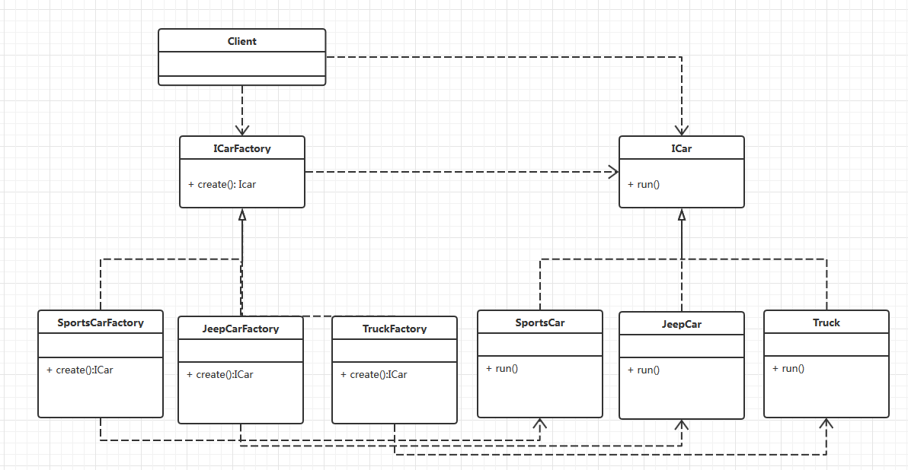
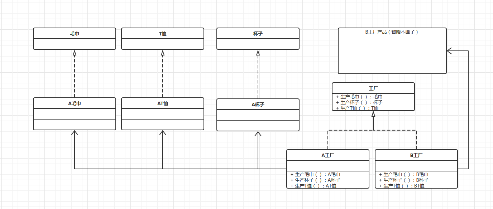

# 介绍

## 简单工厂模式

简单工厂模式（Simple Factory Pattern）通过传给工厂不同的参数来选择不同的创建对象，主要适用于对象创建逻辑比较复杂。

### 适用的场景

- 工厂类创建的对象比较少
- 客户端只需要传入工厂类的参数，对于如何创建对象不需要关系。

### 优点

- 实现与使用都比较简单，而且功能强大。

### 缺点

- 每次新增产品都需要修改工厂类，违背了开闭原则，不利于代码维护。

### UML


### 实现

```java
/**
 * 车辆接口
 */
public interface Icar{
    // 每辆车都可以开
    run();
}
/**
 * 跑车
 */
public class SportsCar implements Icar{
    public void run(){
        System.out.println("启动跑车");
    }
}

/**
 * 吉普车
 */
public class JeepCar implements Icar{
    public void run(){
        System.out.println("启动吉普车");
    }
}

/**
 * 卡车
 */
public class Truck implements Icar{
    public void run(){
        System.out.println("启动卡车");
    }
}

public enum CarType{
    SportsCar,JeepCar,Truck;
}

/**
 * 车辆工厂
 */
public class CarFactory{
    public Icar create(CarType type){
        switch(type){
            case CarType.SportsCar:return new SportsCar();
            case CarType.JeepCar: return new JeepCar();
            case CarType.SportsCar: return new Truck();
        }
        return null;
    }
}

```

客户端使用代码

```java
public class FactoryTest{
    public static void main(String[] args){
        CarFactory carFactory = new CarFactory();
        ICar car =  carFactory.create(CarType.JeepCar);
        car.run();
    }
}
```


## 工厂方法模式

工厂方法模式（Factory Method Pattern）是指 定义一个创建对象的接口，但让视线这个接口的类来决定实例化哪个类，工厂方法让累的实例化推迟到了子类中进行。

属于创建型设计模式

### 适用场景

- 创建对象需要大量重复的代码
- 客户端不依赖于产品类实例如何被创建、实现等细节、一个类通过其子类来指定创建哪个对象。

### 优点

- 解决了简单工厂违反开闭原则的问题，每个产品都使用一个新的工厂来创建。

### 缺点

- 如果产品很多，则将会有很多的工厂。
- 增加了系统的抽象性，和理解难度。

### UML



### 实现

```java
public interface ICarFactory{
    ICar create()；
}

public class SportsCarFactory implements ICarFactory{
    public ICar create(){
        return new SportsCar();
    }
}

public class JeepCarFactory implements ICarFactory{
    public ICar create(){
        return new JeepCar();
    }
}

public class TruckFactory implements ICarFactory{
    public ICar create(){
        return new Truck();
    }
}

```

客户端代码

```java
public class FactoryMethonTest{
    public static void main(String[] args){
        ICarFactory carFactory = new SportsCarFactory();
        ICar car = carFactory.carate();
        car.run();
    }
}
```


## 抽象工厂模式

抽象工厂模式（Abstract Factory Pattern）是指提供一个创建一系列相关或相互依赖对象的接口，无需指定他们具体的类。

抽象工厂模式就像是一个创建一系列相关的产品的工厂。比如A工厂生产毛巾、水杯、上衣，B工厂同样生产毛衣、水杯、上衣，就可以分别实现不同的工厂来提供具体的产品，产品间通过工厂品牌来关联。

### 适用场景

各个创建的产品有相互关联关系时。

### 优点

- 可以将有相互关联关系的对象关联起来放一个工厂中来创建。

### 缺点

- 规定了所有可能被创建的产品集合，产品族中扩展新产品困难，需要修改抽象工厂接口。
- 增加了系统的抽象性和复杂度。

### UML



### 实现

```java
public interface 毛巾{}
public interface T恤{}
public interface 杯子{}

public class A毛巾 implements 毛巾{}
public class AT恤 implements T恤{}
public class A杯子 implements 杯子{}

public interface 工厂{
    毛巾 生产毛巾();
    T恤 生产T恤();
    杯子 生产杯子();
}

public class A工厂 implements 工厂{
    public 毛巾 生产毛巾(){
        return new A毛巾();
    }
    public T恤 生产T恤(){
        return new AT恤;
    }
    public 杯子 生产杯子(){
        return new A杯子();
    }
}
//B工厂同理
//.......

```

客户端调用

```java
public class AbstractFactory{
    public static void main(String[] args){
        工厂 aFactory = new A工厂();
        杯子 glass = aFactory.生产杯子();
        毛巾 towel = aFactory.生产毛巾();
    }
}
```


