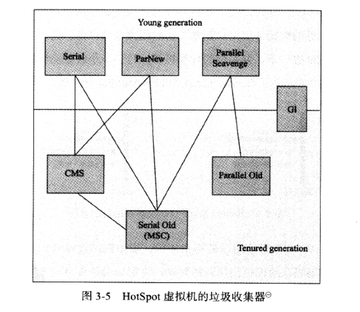

## 哪些内存需要回收？

### 如何确定对象已死（可以回收）

在堆中存放着**Java**世界几乎所有的对象实例，垃圾收集器在对堆进行回收千，第一件事情就是确定这些对象中哪些还“存活”，哪些已经“死去”（即不可能再被任何途径使用）。

#### 引用计数算法

给对象增加一个引用计数器，当对象引用*+1*时引用计数器*+1*，当引用失效时*-1*，当引用计数器的值为0时，该对象不可能被任何对象使用，则进行回收。

这个算法无法解决对象之间的循环引用问题，所以Java虚拟机并没有使用这种算法。

#### 可达性分析算法

通过一系列的**GC Roots**的对象作为起点，从这些节点向下搜索，搜索所走过的路径称为引用链（Reference Chain）,当一个对象到达**GC Roots**没有任何引用链时，则证明此对象不可用。

在**Java**中**GC Roots**包括以下几种：

- **Java**虚拟机栈引用的对象
- 方法区中类静态属性引用的对象
- 方法区中常量引用的对象
- 本地方法栈中JNI引用的对象

## 什么时候回收？

### Minor GC

在年轻代*Young space*（包括Eden区和Survivor区）中的垃圾回收称之为**Monor GC**。这个定义即清晰又不异议。但仍有一些有趣的关于*Minor GC*事件的东西需要你去了解：

- **Minor GC**总是在不能为新的对象分配空间的时候触发，例如*Eden*区满了，分配空间越快，**Minor GC**越频繁。
- 当内存池满了后，它的完整的内容会被复制出入，指针可以从0开始重新跟踪空闲内存。所以取代传统的标记-交换-压缩

当无法为新对象分配空间时触发。对象分配越频繁，回收频次越高。

### Major GC

清理老年去

### Full GC

清理整个内存堆

## 如何回收？

### 垃圾收集算法

#### 标记-清除算法

算法分为**标记**和**清除**两个阶段：

首先标记处需要回收的对象，标记完成后，统一回收被标记的对象。

标记回收算法是最基础的算法，后续的手机算法都是基于这个思路并对其进行改进而得到的。

它有两个不足：

1. 效率问题，标记和清除两个过程的效率都不高。
2. 标记清除后会产生大量不连续的空间碎片，空间碎片太多会导致以后再程序运行过程中需要分配较大对象时，因无法找到足够的连续内存而不得不提前触发另一次垃圾回收。

#### 复制算法

为了有效的解决效率问题，一种称为“复制”的收集算法出现了，它将可用内存按容量划分为大小相等的两块，每次只使用其中的一块。当一块的内存用完了，就将还存活者的对象复制到另一块上面，然后把已使用的过的那块内存空间清理掉。这样对整个半区进行垃圾回收，内存分配时也就不用考虑内存碎片等复杂的情况，只要一动堆定的指针，按顺序分配内存即可。

由于新生代中的对象一般都“朝生夕死”所以并不需要对半分配内存，而是将较大的内存分配给Eden空间将两块较小的空间分配成Survivor空间，每次只使用Eden空间和一个Survivor空间，当回收时，将Survivor和Eden空间中幸存的对象复制到另一块未使用的Survivor空间中。这样只浪费了10%的新生代空间。

当10%的Survivor空间不够使用时，就需要老年代来进行**内存的分配担保**，那些存放不下的对象将直接进入老年代。

#### 标记-整理算法

复制收集算法在对象存活较高时就需要进行较多的复制操作，效率会低很多。关键是不想浪费50%的空间，就需要有额外的空间进行分配担保，以应对被使用的内存中所有对象100%存活的极端情况，所以在老年代一般不使用复制算法。

根据老年代的特点，有人提出了另一种“标记-整理（Mark-Compact）”算法，标记过程仍然与“标记-清除”算法一样，但后续步骤不是直接对可回收对象进行清理，而是让所有的存活对象都移动向一端，然后直接清理掉边界以外的内存。

#### 分代收集算法

根据对象存活周期不同将内存划分为几块。

### 如何发起垃圾回收

### 垃圾收集器

#### Serial（串行/年轻的、老年代）收集器

串行执行垃圾回收。*JDK 1.3.1之前*唯一的垃圾收集器。

#### ParNew（并行/年轻代）收集器

并行执行垃圾回收。

#### Parallel Scavenge（并行/新生代、老年代）收集器

新生代收集器，采用赋值算法

Parallel Scavenge 的目标是达到一个可控的吞吐量。

GC自适应调节策略来实现设置的吞吐量目标。

#### CMS（并发/老年代）收集器

CMS（Concurrent Mark Sweep）收集器是一种以获取最短停顿时间为目标的标记清除收集器。

优点：

- 并发收集
- 低停顿

缺点：

- CMS收集器对CPU资源敏感。CMS并发阶段虽然不会导致用户线程中断，但因为会占用一部分CPU资源会导致程序变慢，总吞吐量遍地。CMS默认启动的回收线程数是 *（CPU数量+3）/4,当CPU数量很少时，影响会比较大。

- CMS收集器无法处理浮动垃圾（Floating Garbage）,可能出现“Concurrent Mode Failure”失败而导致另一次Full GC的产生。

  当CMS在并发回收过程中无法为用户分配对象空间时，就会出现一次“Concurrent Mode Failure”失败，这时虚拟机将启动备案：临时启用Serial Old收集器来进行老年代的垃圾收集，这样停顿时间就会很长。可以通过 *-XX:CMSInitiatingOccupancyFraction*来控制当老年代使用达到多少时来触发一次GC。

  > **浮动垃圾**：由于CMS并发清理阶段用户线程还在运行，伴随着程序的运行自然就会产生新的垃圾，这部分垃圾出现在标记过程之后，所以CMS无法再本次GC回收掉，只能在下一次GC时回收。

- CMS是一款*标记-清除*算法实现的收集器，收集结束后会产生大量的碎片，当给大对象分配内存时，可能会导致命名还有很大的内存未分配却无法找到足够大的连续空间来分配对象内存，不得不提前触发*Full GC*。CMS收集器可以配置当无法分配大对象内存时，进行一次合并整理（默认开启）。也可以设置进行多少次*Full GC*后进行一次内存整理。

整个清除过程分为四个阶段

1. 初始标记（CMS initial mark）--需要 Stop The World

   标记与 GC Roots能直接关联到的对象。

2. 并发标记（CMS concurrent mark）

   GC  Roots Tracing(gc root 追踪)，沿着引用链一直向下标记，知道完成。

3. 重新标记（CMS remark）--需要Stop The World

   修正并发标记期间用户程序继续运作而导致标记产生变动的那一部分对象的标记记录。

4. 并发清除（CMS concurent sweep）

   清除哪些没有标记的对象并回收空间。

   **并发时如何保证清除的空间都是无用的空间？**

   可能会在并发清除阶段进入老年代的对象自动添加被使用标记。

#### G1

G1被赋予的使命是（在比较长的）未来可以替换掉JDK 1.5中发布的CMS收集器。

使用场景：

- 需要低停顿的场合。

优点：

- 并行并发

